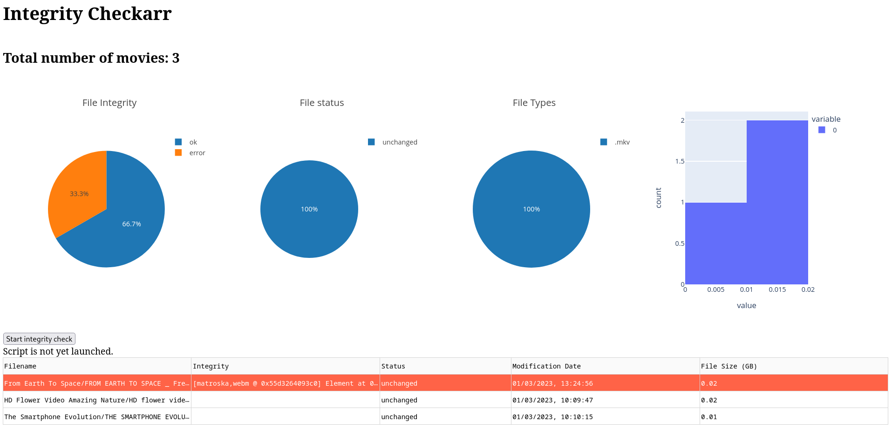

# Integrity Checkarr

This application aims to provide a tool which monitors your movie collection and watches out for corrupt video files
which are not valid.
Movie viles can corrupt due to errors while copying or duringdownloading from a server.

**Integrity Checkarr** provides a nice dashboard built with [Dash](https://dash.plotly.com/).

You can run **Integrity Checkarr** via docker by simply running the `docker-compose.yml` provided in this repo.
You only have to mount your movie collection folder to the `/Movie` path.

What is already implemented?

- [x] List all movies in a directory and check with `ffmpeg` if they are valid
- [x] Present the results and some statistics on a web-dashboard
- [x] Containerise application with docker
- [x] Automate docker CI-CD-pipeline with GitHub actions

What is on the To-Do list?

- [ ] Prettify dashboard
- [ ] Adding tests
- [ ] Adding many more features...

## Disclaimer

This project is still in a early beta-phase, so be sure to mount your movie-collection read-only. I'm not responsible
for any unexpected behavior!
Feel free to report bugs or feature requests via the GitHub issues of this project. Pull requests are welcome!

## Acknowledgement

I want to thank **[Free HD videos - no copyright](https://www.youtube.com/@FreeHDvideosnocopyright)** - channel on YouTube for providing the small license free test clips.
You can find the playlist [here](https://www.youtube.com/playlist?list=PL4Gr5tOAPttLOY9IrWVjJlv4CtkYI5cI_).